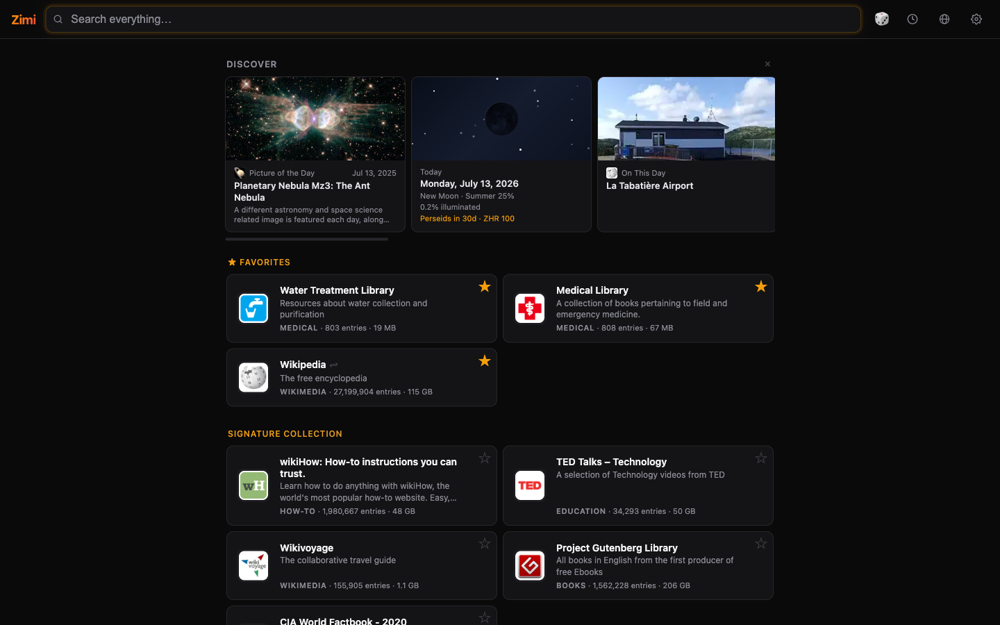
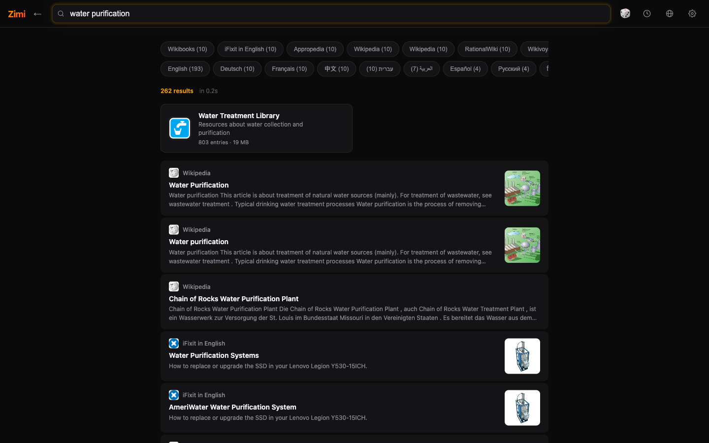
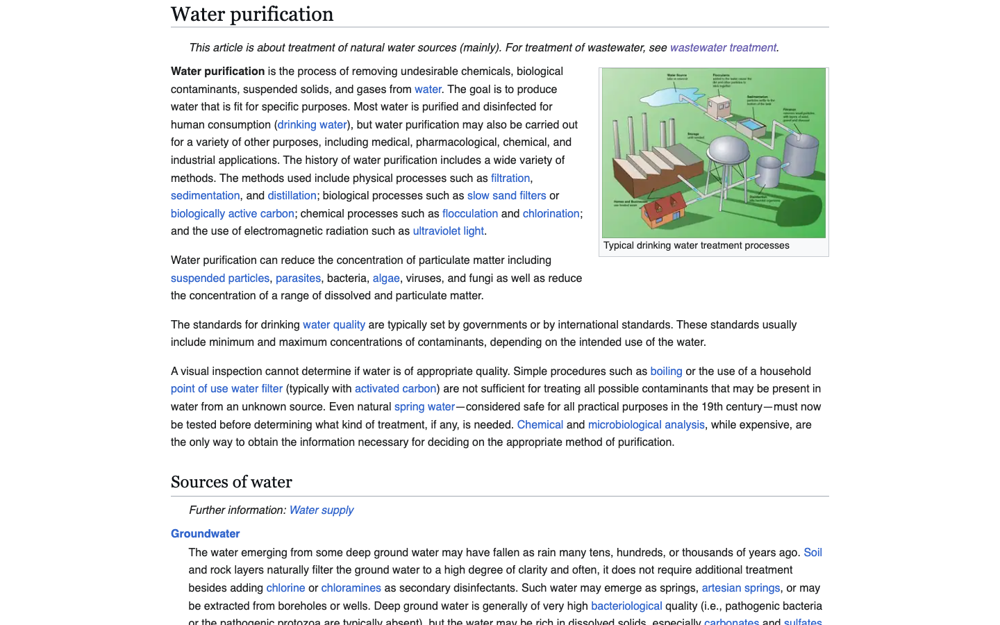
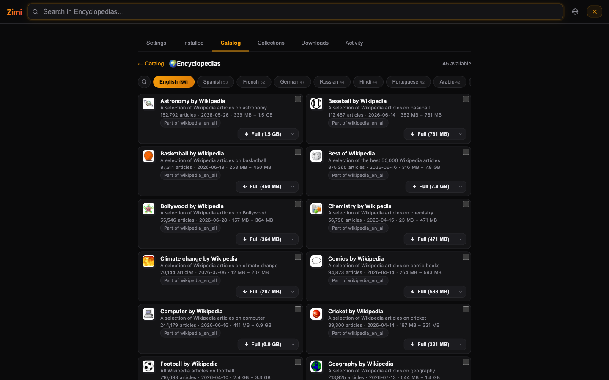

# Zimi

Offline knowledge server for ZIM files. Search and read Wikipedia, Stack Overflow, dev docs, and 50+ other sources, no internet required.

[Kiwix](https://kiwix.org) packages the world's knowledge into ZIM files. Zimi serves them with a fast JSON API, a modern web UI, and an MCP server for AI agents. Everything works offline. Everything works in your language.

## What's in the box

- **10 languages.** English, French, German, Spanish, Portuguese, Russian, Chinese, Arabic, Hindi, Hebrew. RTL support.
- **Cross-language navigation.** Switch articles between languages via Wikidata Q-IDs and fuzzy matching. Download missing languages inline.
- **Cross-source search.** Parallel full-text search across all sources. Filter by language or source.
- **Discover.** Daily cards: Picture of the Day, On This Day, Quote, Word, Book, Destination, Talk, Comic, Country.
- **Bookmarks and history.**
- **Catalog browser.** 1,000+ Kiwix archives, 10+ categories, instant language filtering.
- **Library management.** Auto-updates, password protection, download queue.
- **Collections.** Group sources for scoped search.
- **JSON API.** Every feature accessible programmatically with token auth.
- **MCP server.** 11 tools for AI agents.
- **Desktop and mobile.** Native macOS app. PWA on mobile.

## Languages

Language support goes deep. The UI is fully localized, but that's the surface.

On the homepage, every source shows its language. In the catalog, filter by language instantly to find content in the language you want. When reading an article, open the language dropdown to see every installed translation, matched through Wikidata Q-IDs for Wikipedia-family sources and fuzzy title matching for everything else. If a language isn't installed, download it right from the dropdown and Zimi navigates to the article when it's ready.

Search results include language pills so you can filter a broad query down to just French or just Hebrew results. The `/search` API accepts a `lang` parameter. The MCP `article_languages` tool returns every language an article is available in.

If you find a cross-language match that's wrong, or a language that isn't working, [open an issue](https://github.com/epheterson/Zimi/issues).

## Screenshots

| Homepage | Search Results |
|----------|---------------|
|  |  |

| Article Reader | Catalog |
|----------------|---------|
|  |  |

## Install

### macOS

```bash
brew tap epheterson/zimi && brew install --cask zimi
```

Or download from [GitHub Releases](https://github.com/epheterson/Zimi/releases).

### Linux

```bash
sudo snap install zimi
```

Or grab the [AppImage](https://github.com/epheterson/Zimi/releases).

### Docker

```bash
docker run -v ./zims:/zims -p 8899:8899 epheterson/zimi
```

Open http://localhost:8899. No ZIM files yet? Browse and download from the built-in catalog.

### Python

```bash
pip install zimi
ZIM_DIR=./zims zimi serve --port 8899
```

## API

| Endpoint | Description |
|----------|-------------|
| `GET /search?q=...&limit=5&zim=...&fast=1&lang=...` | Full-text search. `fast=1` for title matches only. `lang` filters by language. |
| `GET /read?zim=...&path=...&max_length=8000` | Read article as plain text |
| `GET /suggest?q=...&limit=10&zim=...` | Title autocomplete |
| `GET /list` | List all sources with metadata |
| `GET /article-languages?zim=...&path=...` | All languages an article is available in |
| `GET /catalog?zim=...` | PDF catalog for zimgit ZIMs |
| `GET /snippet?zim=...&path=...` | Short text snippet |
| `GET /random?zim=...` | Random article |
| `GET /collections` | List collections |
| `POST /collections` | Create/update a collection |
| `DELETE /collections?name=...` | Delete a collection |
| `GET /resolve?url=...` | Resolve external URL to ZIM path |
| `POST /resolve` | Batch resolve: `{"urls": [...]}` |
| `GET /health` | Health check with version |
| `GET /w/<zim>/<path>` | Serve raw ZIM content |

### Examples

```bash
# Search across all sources
curl "http://localhost:8899/search?q=python+asyncio&limit=5"

# Search in French only
curl "http://localhost:8899/search?q=eau&lang=fr&limit=5"

# Find all languages for an article
curl "http://localhost:8899/article-languages?zim=wikipedia&path=A/Water"

# Read an article
curl "http://localhost:8899/read?zim=wikipedia&path=A/Water_purification"
```

## MCP Server

Zimi includes an MCP server for AI agents.

```json
{
  "mcpServers": {
    "zimi": {
      "command": "python3",
      "args": ["-m", "zimi.mcp_server"],
      "env": { "ZIM_DIR": "/path/to/zims" }
    }
  }
}
```

For Docker on a remote host:

```json
{
  "mcpServers": {
    "zimi": {
      "command": "ssh",
      "args": ["your-server", "docker", "exec", "-i", "zimi", "python3", "-m", "zimi.mcp_server"]
    }
  }
}
```

Tools: `search`, `read`, `suggest`, `list_sources`, `random`, `article_languages`, `read_with_links`, `deep_search`, `list_collections`, `manage_collection`, `manage_favorites`

The `search` tool accepts a `lang` parameter to filter by language. `article_languages` returns every installed translation of an article. `deep_search` does progressive full-text search with snippets.

## Docker Compose

```yaml
services:
  zimi:
    image: epheterson/zimi
    container_name: zimi
    restart: unless-stopped
    ports:
      - "8899:8899"
    volumes:
      - ./zims:/zims
    environment:
      - ZIM_DIR=/zims
```

### Environment Variables

| Variable | Default | Description |
|----------|---------|-------------|
| `ZIM_DIR` | `/zims` | Path to ZIM files |
| `ZIMI_MANAGE` | `1` | Library manager. `0` to disable. |
| `ZIMI_MANAGE_PASSWORD` | _(none)_ | Protect library management |
| `ZIMI_AUTO_UPDATE` | `0` | Auto-update ZIMs (`1` to enable) |
| `ZIMI_UPDATE_FREQ` | `weekly` | `daily`, `weekly`, or `monthly` |
| `ZIMI_RATE_LIMIT` | `60` | Requests/min/IP. `0` to disable. |

## Zimi vs kiwix-serve

[kiwix-serve](https://github.com/kiwix/kiwix-tools) is the official Kiwix server. Both serve ZIM files. Here's how they differ:

| | Zimi | kiwix-serve |
|---|---|---|
| **Search** | JSON API, parallel search, cross-source ranking | HTML responses, sequential |
| **Library** | Built-in catalog browser, downloads, auto-updates | Separate CLI tool |
| **Languages** | 10-language UI, cross-language article navigation | English only |
| **AI** | MCP server for Claude Code | None |
| **Desktop** | Native macOS app, PWA | kiwix-desktop (separate) |
| **Runtime** | Python + JS | C++ (libkiwix) |
| **Memory** | Higher (Python + indexes) | Lower (native C++) |

Use kiwix-serve for lightweight serving on low-memory devices. Use Zimi for APIs, multi-language, library management, AI integration, or a desktop app.

## Contributing

See [CONTRIBUTING.md](CONTRIBUTING.md).

## License

[MIT](LICENSE)

---

Built with ❤️ in California by [@epheterson](https://github.com/epheterson) and [Claude Code](https://claude.ai/code).
