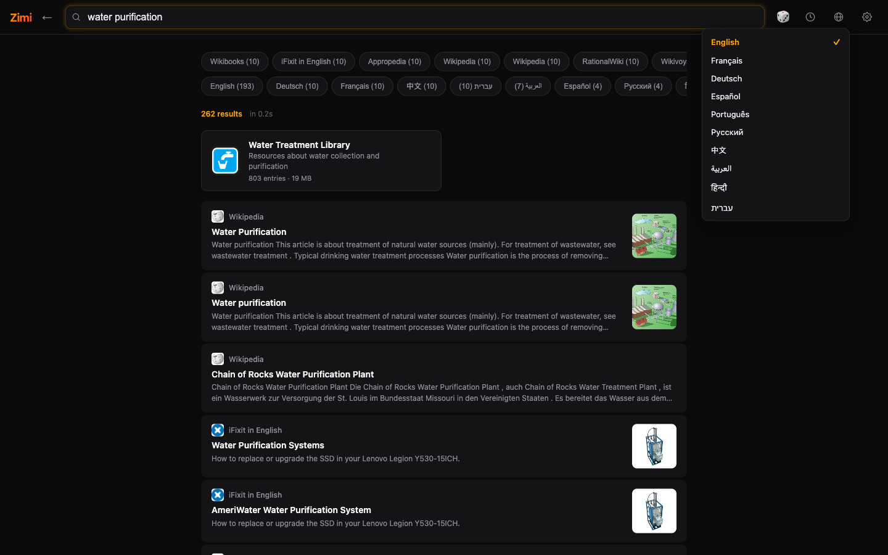
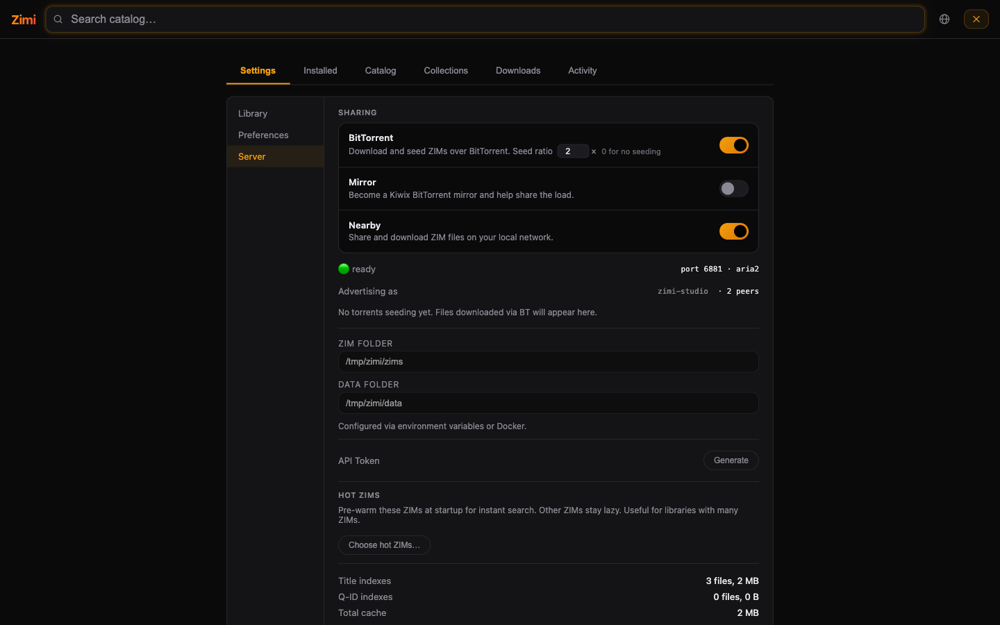

# Zimi

[](https://github.com/epheterson/Zimi/actions/workflows/ci.yml)
[](#)
[](docs/plans/2026-04-26-accessibility.md)
[](docs/plans/2026-04-26-accessibility.md)
[](#languages)
[](https://hub.docker.com/r/epheterson/zimi)
[](https://pypi.org/project/zimi/)
[](LICENSE)

Zimi is

- **The offline internet.** Entire websites, cross-ZIM linking, search engine and native browser experience.
- **Search that hits everything.** One query, every source, 140M+ articles, the right answer on top. Fast.
- **Multilingual.** Switch any article into any language it has. Ten UI languages built in.
- **A real library.** 1,000+ archives one click away, auto-updates, collections, batch downloads, bookmarks and history.
- **A mesh.** Your machines find each other and pass ZIMs around at LAN speed, no internet needed.
- **A good citizen.** Downloads arrive over BitTorrent and seed back to the Kiwix network. One switch makes you a full mirror.
- **Fresh daily.** Picture of the Day, On This Day, a word, a quote, a comic, a live almanac sky. All computed locally, forever.
- **Anywhere.** Docker, pip, a native macOS app, or your phone as a PWA.
- **For humans and machines.** Web UI, JSON API, MCP server for AI agents.

## Screenshots

| Homepage | Search Results |
|----------|---------------|
|  |  |

| Language Switching | Catalog |
|-------------------|---------|
|  |  |

| Article Reader | Sharing |
|----------------|---------|
|  |  |

## Languages

Not an afterthought. Language is deeply integrated into every aspect of Zimi so you can focus on your content and feel at home. Enjoy filtered lists, labeled sources, RTL support and no rock left unturned.
- **10 languages.** English, French, German, Spanish, Portuguese, Russian, Chinese, Arabic, Hindi, Hebrew.

Something not right? [Open an issue.](https://github.com/epheterson/Zimi/issues)

## Install

### macOS

```bash
brew tap epheterson/zimi && brew install --cask zimi
```

Or download from [GitHub Releases](https://github.com/epheterson/Zimi/releases).

### Linux

```bash
sudo snap install zimi
```

Or grab the [AppImage](https://github.com/epheterson/Zimi/releases).

### Docker

```bash
docker run --network host -v ./zims:/zims -v ./zimi-config:/config epheterson/zimi
```

`/zims` is where ZIM files live. `/config` persists cache, indexes, and settings. Open http://localhost:8899.

`--network host` is recommended so LAN peer discovery (mDNS) and BitTorrent seeding work out of the box. If you can't use host networking, see "Bridge mode" below.

<details>
<summary>Docker Compose (recommended — host networking)</summary>

```yaml
services:
  zimi:
    image: epheterson/zimi
    container_name: zimi
    restart: unless-stopped
    network_mode: host           # mDNS + BT seeding work without port plumbing
    volumes:
      - ./zims:/zims             # ZIM files go here
      - ./zimi-config:/config    # cache, indexes, settings
```
</details>

<details>
<summary>Docker Compose (bridge mode — no LAN discovery)</summary>

```yaml
services:
  zimi:
    image: epheterson/zimi
    container_name: zimi
    restart: unless-stopped
    ports:
      - "8899:8899"
      - "6881:6881/tcp"          # BitTorrent (TCP)
      - "6881:6881/udp"          # BitTorrent (UDP / DHT)
    volumes:
      - ./zims:/zims
      - ./zimi-config:/config
```

LAN peer discovery (`_zimi._tcp`) won't reach the LAN in bridge mode — multicast doesn't cross the docker bridge. BT seeding still works because aria2 binds the mapped port. See [docs/deployment-networking.md](docs/deployment-networking.md) for the full discussion.
</details>

### Python

```bash
pip install zimi
ZIM_DIR=./zims zimi serve --port 8899
```

## Sharing

Zimi assumes knowledge should flow. Three switches in Server Settings control all of it:

- **BitTorrent** (on by default). Downloads arrive via the Kiwix swarm and seed back, capped at a ratio you choose. `0` means never seed. No aria2 installed? Everything quietly uses plain HTTP.
- **Nearby** (off by default). Flip it on and Zimi devices on your network find each other; a green pill on a catalog card means a neighbor already has that ZIM. Transfers stay on your LAN, never the internet.
- **Mirror** (off). Lifts the seeding cap, for people who want to run a long-term Kiwix mirror.

Seeding needs no router setup. Forwarding your BitTorrent port (default 6881) lets peers connect to you directly, which helps on quiet swarms. Optional.

### Environment Variables

Most people set nothing: every setting below has a sensible default or lives in the UI.

| Variable | Default | Description |
|----------|---------|-------------|
| `ZIM_DIR` | `/zims` | Path to ZIM files (scanned for `*.zim` on startup) |
| `ZIMI_DATA_DIR` | `/config` (Docker) or `$ZIM_DIR/.zimi` | Cache, indexes, and settings. Mount separately in Docker. |
| `ZIMI_MANAGE_PASSWORD` | _(none)_ | Protect library management |
| `ZIMI_BT` | `on` | BitTorrent: `off`, or `on,port=6881,ratio=2,up=2048,mirror=off`. Fields you set are locked in the UI; fields you leave out stay UI-controlled. `ratio=0` means never seed. |
| `ZIMI_NEARBY` | `off` | LAN sharing: `off`, or `on,name=my-zimi,public=off`. Controls serving *and* fetching between your Zimi devices. |

<details>
<summary>Advanced</summary>

| Variable | Default | Description |
|----------|---------|-------------|
| `ZIMI_MANAGE` | `1` | Library manager. `0` to disable entirely. |
| `ZIMI_AUTO_UPDATE` | `0` | Auto-update ZIMs (`1` to enable; also a UI setting) |
| `ZIMI_UPDATE_FREQ` | `weekly` | `daily`, `weekly`, or `monthly` |
| `ZIMI_RATE_LIMIT` | `60` | Requests/min/IP. `0` to disable. |
| `ZIMI_API_TOKEN` | _(none)_ | Pin the API token instead of generating in the UI |
| `ZIMI_HOT_ZIMS` | _(none)_ | Comma-separated ZIM names to pre-warm at startup |

</details>

## API

| Endpoint | Description |
|----------|-------------|
| `GET /search?q=...&limit=5&zim=...&fast=1&lang=...` | Full-text search. `fast=1` for title matches only. `lang` filters by language. |
| `GET /read?zim=...&path=...&max_length=8000` | Read article as plain text |
| `GET /suggest?q=...&limit=10&zim=...` | Title autocomplete |
| `GET /list` | List all sources with metadata |
| `GET /article-languages?zim=...&path=...` | All languages an article is available in |
| `GET /catalog?zim=...` | PDF catalog for zimgit ZIMs |
| `GET /snippet?zim=...&path=...` | Short text snippet |
| `GET /random?zim=...` | Random article |
| `GET /collections` | List collections |
| `POST /collections` | Create/update a collection |
| `DELETE /collections?name=...` | Delete a collection |
| `GET /resolve?url=...` | Resolve external URL to ZIM path |
| `POST /resolve` | Batch resolve: `{"urls": [...]}` |
| `GET /health` | Health check with version |
| `GET /w/<zim>/<path>` | Serve raw ZIM content |

### Examples

```bash
# Search across all sources
curl "http://localhost:8899/search?q=python+asyncio&limit=5"

# Search in French only
curl "http://localhost:8899/search?q=eau&lang=fr&limit=5"

# Find all languages for an article
curl "http://localhost:8899/article-languages?zim=wikipedia&path=A/Water"

# Read an article
curl "http://localhost:8899/read?zim=wikipedia&path=A/Water_purification"
```

## MCP Server

Zimi includes an MCP server for AI agents.

```json
{
  "mcpServers": {
    "zimi": {
      "command": "python3",
      "args": ["-m", "zimi.mcp_server"],
      "env": { "ZIM_DIR": "/path/to/zims" }
    }
  }
}
```

For Docker on a remote host:

```json
{
  "mcpServers": {
    "zimi": {
      "command": "ssh",
      "args": ["your-server", "docker", "exec", "-i", "zimi", "python3", "-m", "zimi.mcp_server"]
    }
  }
}
```

Tools: `search` (with `lang` filter), `read`, `suggest`, `list_sources`, `random`, `article_languages`, `read_with_links`, `deep_search`, `list_collections`, `manage_collection`, `manage_favorites`

## Integrations

- **[SearXNG](docs/integrations/searxng.md)** — route queries through Zimi from a self-hosted SearXNG metasearch instance.
- **[OpenWebUI / generic AI](docs/integrations/openwebui.md)** — wire the MCP server into any AI client for offline research.

## Contributing

See [CONTRIBUTING.md](CONTRIBUTING.md).

## License

[MIT](LICENSE)

---

Built with ❤️ in California by [@epheterson](https://github.com/epheterson) and [Claude Code](https://claude.ai/code).
