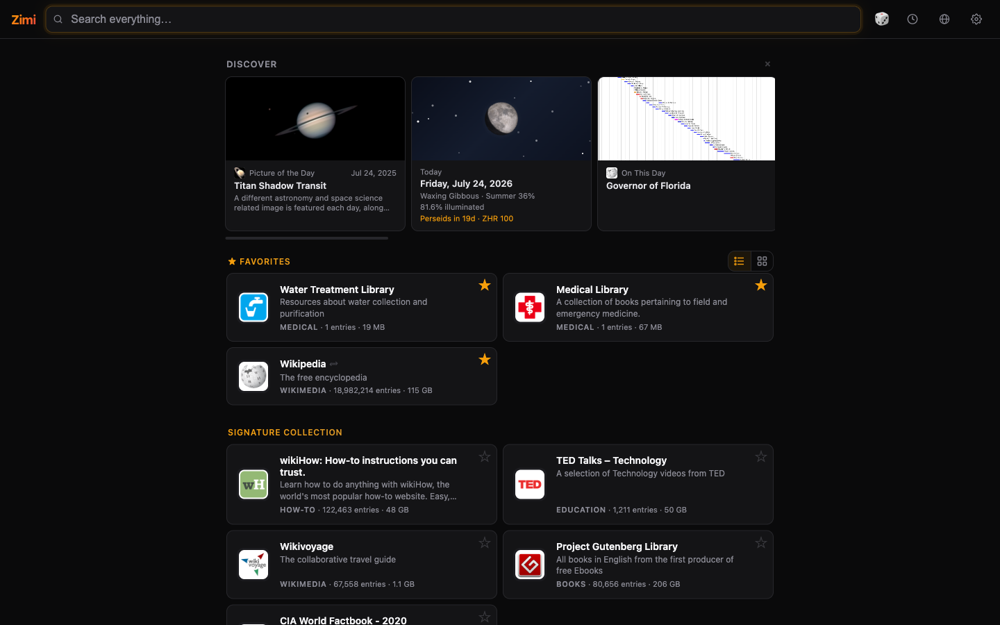
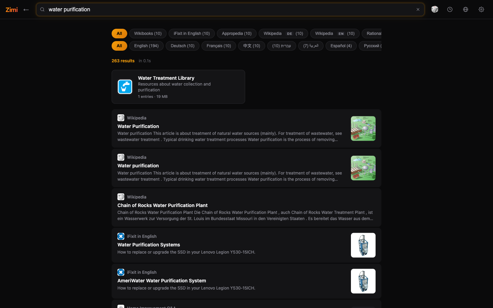
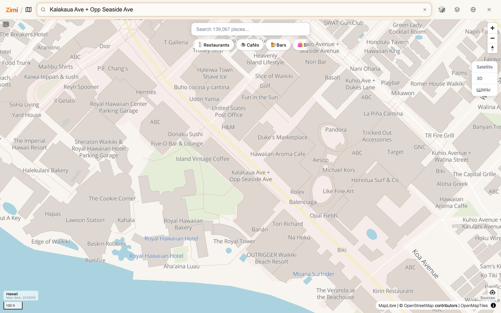
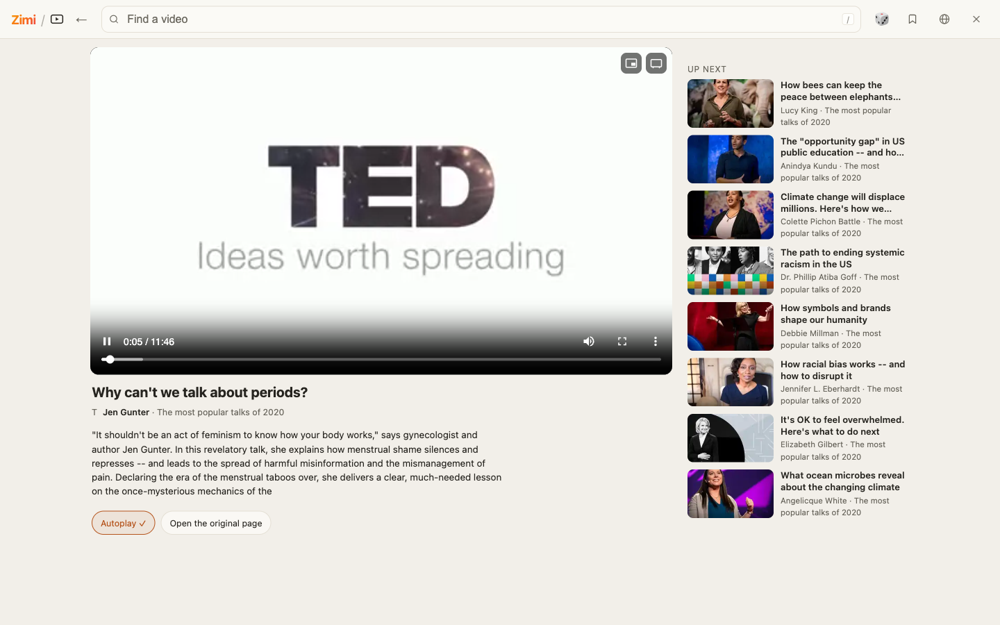
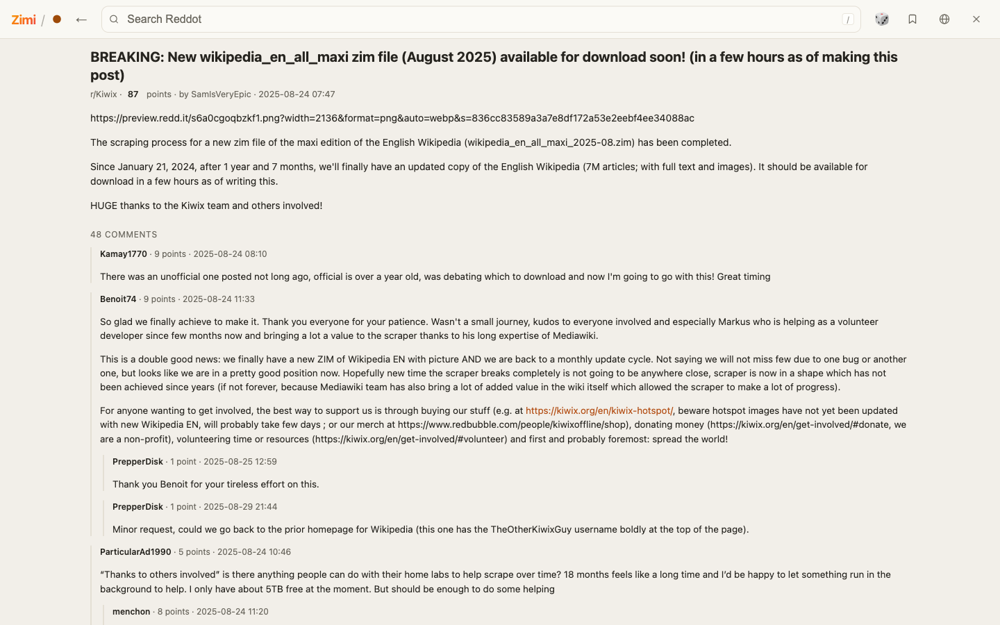
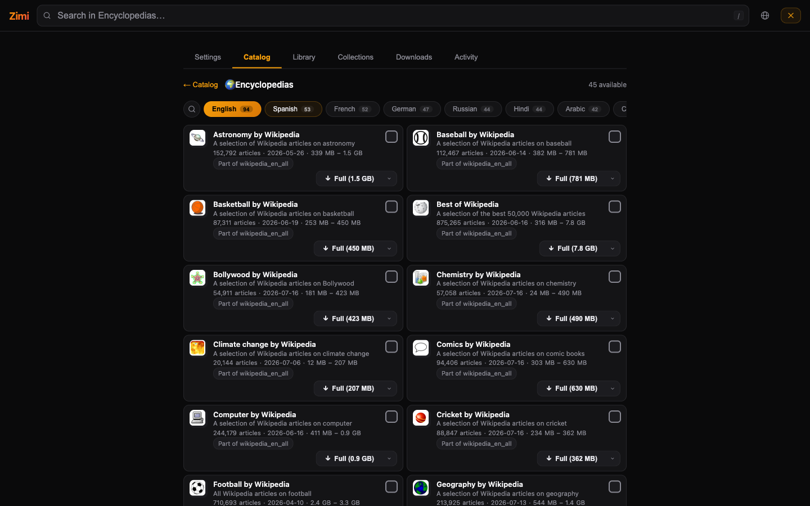
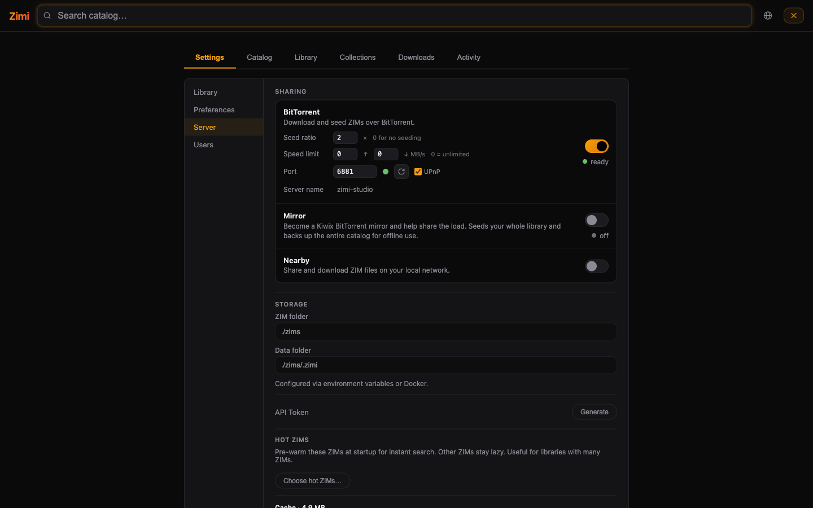
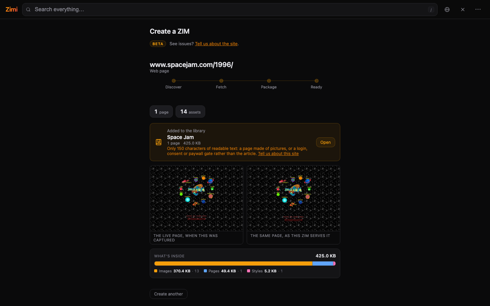

# Zimi

[](https://github.com/epheterson/Zimi/actions/workflows/ci.yml)
[](#)
[](docs/plans/2026-04-26-accessibility.md)
[](docs/plans/2026-04-26-accessibility.md)
[](#languages)
[](https://hub.docker.com/r/epheterson/zimi)
[](https://pypi.org/project/zimi/)
[](LICENSE)

A modern experience for your ZIM files.

[Kiwix](https://kiwix.org) packages the world's knowledge into ZIM files. Zimi makes them feel like the real internet with a rich web UI, fast JSON API, and an MCP server for AI agents. Everything works offline, in your language.

## What is Zimi?

- **The offline internet.** Whole sites, cross-ZIM links, real search, a browser that feels like one.
- **Apps over your library.** Offline street maps, every video ZIM as one feed, every Q&A in one place, and your favorite subreddits thread together.
- **Search that hits everything.** One query, every source, 100M+ articles, the right answer on top.
- **A real library.** 1,000+ archives one click away, auto-updating, with collections and bookmarks.
- **Multilingual.** Any article in any language it has. Ten UI languages built in.
- **Fresh daily.** Picture of the Day, On This Day, a word, a quote, a comic, a live sky. Computed locally, forever.
- **Your own network.** Your machines find each other and pass ZIMs around at LAN speed.
- **A good citizen.** Downloads come over BitTorrent and seed back. One switch makes you a mirror.
- **Manageable.** Accounts and per-ZIM access, wide open or sign-in only. A health endpoint and an activity log when you need them.
- **Accessible.** Keyboard, screen reader, high contrast. Built in, not bolted on.
- **A ZIM creator (beta).** A page, a site, a video or playlist, a subreddit, your bookmarks or a folder becomes a ZIM.
- **For humans and machines.** Web UI, JSON API, MCP server for agents.
- **Anywhere.** Docker or Podman, pip, native apps for macOS, Windows and Linux, or your phone as a PWA.
- **Improving.** Regular updates, shaped by what people ask for. Just ask.

## Apps

Some ZIMs hold a map, a video library, a Q&A site, a subreddit or a wiki. Zimi gives each kind a view of its own, over whatever you already have.

- **Maps.** Kiwix's regional maps and StreetZim's larger builds. Type a town, a street or an address and the map flies there; the position lives in the address bar, so a link or a bookmark comes back to the same place at the same zoom.
- **ZimiTube.** Every video ZIM as one feed: Kiwix's TED and TED-Ed, YouTube channels, and the ones `zimi create` makes. Subtitles, Up next, autoplay, a dock so a video keeps playing while you browse.
- **ZimiExchange.** Every Stack Exchange site as one place: a shelf per site with its top tags, paged lists, and a question with its answers scored, the accepted one first.
- **Reddot.** Subreddits as ZIMs. `zimi create r/<name>` builds one from the public Arctic Shift archive; the app reads shelves, Top and New, and a post's whole comment tree.
- **Zimipedia.** Every wiki as one: Wikipedia in each language, Wiktionary, Wikivoyage, Wikiquote and the other MediaWiki wikis. A pill per wiki narrows everything; Today brings On this day, pictures from across the wikis, a word, a quote and a place; search covers the wikis you picked, as cards or a list.

They share the shell: one search box, one back arrow, bookmarks and history, right to left where the language runs that way. Each can be offered or not, for the whole server or per account, and an agent reads the same content through the API and MCP tools. See the [apps guide](docs/features/apps.md).

## Screenshots

| Homepage | Search Results |
|----------|---------------|
|  |  |

| Maps | ZimiTube |
|------|----------|
|  |  |

| Reddot | Catalog |
|--------|---------|
|  |  |

| Sharing | Make a ZIM |
|---------|------------|
|  |  |

## Languages

Not an afterthought. Language is deeply integrated into every aspect of Zimi so you can focus on your content and feel at home. Enjoy filtered lists, labeled sources, RTL support and no rock left unturned.
- **10 languages.** English, French, German, Spanish, Portuguese, Russian, Chinese, Arabic, Hindi, Hebrew.

Something not right? [Open an issue.](https://github.com/epheterson/Zimi/issues) Found a security problem? See [SECURITY.md](SECURITY.md) and report it privately.

## Sharing

Three switches in Server Settings control all of it:

- **BitTorrent** (on by default). Downloads arrive via the Kiwix swarm and seed back, capped at a ratio you choose. `0` means never seed. The engine is in-process libtorrent: the desktop apps and Docker image bundle it, and `pip install zimi` pulls it automatically wherever a prebuilt wheel exists (CPython 3.9–3.13 on Linux, macOS, and Windows). If there's no wheel for your interpreter, Python 3.14+ has none yet, Zimi quietly falls back to plain HTTP and prints the one-line fix; `pip install zimi[bt]` forces the attempt. UPnP asks your router to open the port, and the settings panel shows whether it worked. Concurrent downloads and the peer-connection limit are tunable in the same panel.
- **Nearby** (off by default). Flip it on and Zimi devices on your network find each other; a green pill on a catalog card means a neighbor already has that ZIM. Transfers stay on your LAN, never the internet.
- **Mirror** (off). Lifts the seeding cap, for people who want to run a long-term Kiwix mirror.

Seeding needs no router setup: Zimi opens the BitTorrent port automatically (UPnP) and the settings show whether peers can reach you, with a retry when they can't. DHT is on too, so magnet links and trackerless swarms just work.

## Make your own ZIMs

The library isn't only what you download. Zimi packages new ZIMs from the **+** button in the web app or `zimi create` on the command line. Every mode previews what you'll get before anything runs, streams a live log while it works, and the result joins your library the moment it finishes.

- **A folder**: HTML, Markdown (rendered by a built-in converter), and PDFs become a browsable ZIM, cross-file links intact. Command line only (`zimi create ./folder`), the web app deliberately doesn't read the server's filesystem.
- **A web page**: one URL, or a list of up to twenty, captured with its images, styles, and fonts.
- **A whole site**: a bounded, polite, same-origin crawl: page, depth, and byte budgets, robots.txt honored, and Ctrl-C still writes a valid ZIM of everything captured so far.
- **Videos**: a playlist or channel becomes an offline video ZIM with subtitles, powered by yt-dlp.
- **A subreddit**: `zimi create r/<name>`, or the subreddit's address pasted into the web app, packages its posts and comment trees from the public Arctic Shift archive.
- **A web archive**: `zimi import` converts WARC and WACZ files from ArchiveBox, Webrecorder, browsertrix, or HTTrack. Powered by a managed warc2zim sidecar (needs Python 3.14 and libmagic on the machine, the Docker image ships both).

Three capture engines trade speed for fidelity: **Fast** (no browser required), **Rendered** (a real headless Chromium draws pages that build themselves in JavaScript), and **Alive** (records the browser session so the page's own JavaScript still runs offline, menus, galleries, videos). Rendered and Alive can block ads and trackers at capture time from a published blocklist.

Every created ZIM carries honest provenance (which Zimi, which tools, how many pages and bytes, what was blocked) as openZIM-spec metadata validated with zimcheck. Right-click any library card → **About this ZIM** to see it.

## Install

### macOS

```bash
brew tap epheterson/zimi
brew trust --tap epheterson/zimi   # Homebrew 6 and later; leave it out before 6
brew install --cask zimi
```

Or download from [GitHub Releases](https://github.com/epheterson/Zimi/releases).

### Linux

```bash
sudo snap install zimi
```

Or grab the [AppImage](https://github.com/epheterson/Zimi/releases). The native window is WebKitGTK, which the AppImage takes from your distro: `sudo apt install libwebkit2gtk-4.1-0` (Ubuntu, Mint, Debian 12), `sudo dnf install webkit2gtk4.1` (Fedora), `sudo pacman -S webkit2gtk-4.1` (Arch); 4.0 works too. Without it Zimi opens in your web browser instead, and `Zimi --browser` does that on purpose. A black window is WebKitGTK's GPU path on some drivers: Zimi already runs with `WEBKIT_DISABLE_DMABUF_RENDERER=1`; set it to `0` to try the GPU path.

### Docker

```bash
docker run --network host -v ./zims:/zims -v ./zimi-config:/config epheterson/zimi
```

`/zims` is where ZIM files live. `/config` persists cache, indexes, and settings. Open http://localhost:8899.

`--network host` is recommended so LAN peer discovery (mDNS) and BitTorrent seeding work out of the box. If you can't use host networking, see "Bridge mode" below.

<details>
<summary>Docker Compose (recommended, host networking)</summary>

```yaml
services:
  zimi:
    image: epheterson/zimi
    container_name: zimi
    restart: unless-stopped
    network_mode: host           # mDNS + BT seeding work without port plumbing
    volumes:
      - ./zims:/zims             # ZIM files go here
      - ./zimi-config:/config    # cache, indexes, settings
```
</details>

<details>
<summary>Docker Compose (bridge mode, no LAN discovery)</summary>

```yaml
services:
  zimi:
    image: epheterson/zimi
    container_name: zimi
    restart: unless-stopped
    ports:
      - "8899:8899"
      - "6881:6881/tcp"          # BitTorrent (TCP)
      - "6881:6881/udp"          # BitTorrent (UDP / DHT)
    volumes:
      - ./zims:/zims
      - ./zimi-config:/config
```

LAN peer discovery (`_zimi._tcp`) won't reach the LAN in bridge mode, multicast doesn't cross the docker bridge, and Zimi warns in the Nearby settings when it detects this. Use host networking, or set `ip=<your host's LAN address>` in `ZIMI_NEARBY`. BT seeding still works because libtorrent binds the mapped port. See [docs/deployment-networking.md](docs/deployment-networking.md) for the full discussion.
</details>

<details>
<summary>Podman (rootless)</summary>

The same image runs under Podman. Two flags matter that Docker never needed:

```bash
mkdir -p zims zimi-config
podman run -d --name zimi --network host \
  --userns=keep-id:uid=1000,gid=1000 \
  -v ./zims:/zims:Z -v ./zimi-config:/config:Z \
  docker.io/epheterson/zimi
```

`--userns=keep-id:uid=1000,gid=1000` maps the image's user to you, so the ZIMs Zimi downloads into `./zims` are yours to read and delete; without it, rootless Podman writes them as a subordinate UID. `:Z` is the SELinux label Fedora and RHEL require on a bind mount, and is harmless on other systems.

To start it at boot, install [deploy/podman/zimi.container](deploy/podman/zimi.container) under `~/.config/containers/systemd/` (a Quadlet unit; the file explains each line), then `systemctl --user daemon-reload && systemctl --user start zimi`. `podman compose` also reads the compose file above once you add `:Z` to its two volumes.
</details>

### Python

```bash
pip install zimi
ZIM_DIR=./zims zimi serve --port 8899
```

### Environment Variables

Most people set nothing: every setting below has a sensible default or lives in the UI.

| Variable | Default | Description |
|----------|---------|-------------|
| `ZIM_DIR` | `/zims` | Path to ZIM files (scanned for `*.zim` on startup) |
| `ZIMI_DATA_DIR` | `/config` (Docker) or `$ZIM_DIR/.zimi` | Cache, indexes, and settings. Mount separately in Docker. |
| `ZIMI_MANAGE_PASSWORD` | _(none)_ | Protect library management |
| `ZIMI_MANAGE_OPEN` | `0` | `1` turns management authentication off entirely: no password, no setup key, no question about the address. Only for a network you control; it warns at every boot. |
| `ZIMI_LAN_ADMIN` | `0` | `1` makes any direct private-network client the admin while no password is set, as before 1.9.0. Not through a proxy. |
| `ZIMI_PUBLIC_ACCESS` | `open` | What an anonymous visitor sees: `open` (whole library), `limited` (an admin-chosen allowlist), or `private` (sign-in required). Also a UI setting; the env var wins when set. |
| `ZIMI_BT` | `on` | BitTorrent: `off`, or `on,port=6881,ratio=2,up=2048,seed=on,mirror=off,upnp=on,dht=on,active=4,conns=200`. `seed`, `upnp`, and `dht` default on. `active` caps concurrent downloads (the rest queue; governs HTTP too, legacy `ZIMI_MAX_CONCURRENT_DOWNLOADS` still works), `conns` is the global peer-connection limit. Fields you set are locked in the UI; fields you leave out stay UI-controlled. `ratio=0` means never seed. |
| `ZIMI_NEARBY` | `off` | LAN sharing: `off`, or `on,name=my-zimi,public=off,ip=192.168.1.20`. Controls serving *and* fetching between your Zimi devices. Set `ip=` to your host's LAN address when running Docker in bridge mode. |

<details>
<summary>Advanced</summary>

| Variable | Default | Description |
|----------|---------|-------------|
| `ZIMI_MANAGE` | `1` | Library manager. `0` to disable entirely. |
| `ZIMI_AUTO_UPDATE` | `0` | Auto-update ZIMs (`1` to enable; also a UI setting) |
| `ZIMI_UPDATE_FREQ` | `weekly` | `daily`, `weekly`, or `monthly` |
| `ZIMI_RATE_LIMIT` | `60` | Requests/min/IP for anonymous clients. `0` to disable. |
| `ZIMI_RATE_LIMIT_TRUSTED` | `600` | Budget for logged-in clients (and private-network clients on passwordless instances). |
| `ZIMI_API_TOKEN` | _(none)_ | Pin the API token instead of generating in the UI |
| `ZIMI_HOT_ZIMS` | _(none)_ | Comma-separated ZIM names to pre-warm at startup |
| `ZIMI_OFFLINE` | `0` | `1` guarantees zero outbound traffic: no update checks, no catalog fetches, no torrent stack. For air-gapped machines. |
| `ZIMI_CREATE_ROOT` | _(none)_ | Where the Create page's Import mode looks for WARC/WACZ archives, subfolders included. Unset, it looks in the library folder. Nothing is typed in the browser: the page lists what it finds and you pick. The CLI is unaffected. |
| `ZIMI_UPDATE_CHANNEL` | `latest` | App release channel: `latest` (finished releases) or `beta` (prereleases too). Locks the UI choice when set. |
| `ZIMI_UPDATE_DELAY_DAYS` | `0` | Hold a release back until it has been public this many days (0–365). |

</details>

## Self-hosting & operations

Zimi runs seriously with zero ceremony: `zimi serve` in or beside a folder of ZIMs discovers it and keeps its state in a `.zimi` folder next to the content. A USB stick is a valid deployment. When you want more control:

- **One config file.** `zimi.json` holds paths, auth, sharing, and serving settings; `zimi config` prints every effective value and exactly where it came from, flag, environment, file, discovery, or default.
- **Backup and restore.** `zimi backup` writes settings, bookmarks, collections, and user data to one file; `zimi restore` brings a fresh install back from it.
- **Provable offline.** `ZIMI_OFFLINE=1` is a real air-gap switch, verified by a test that records every outbound socket.
- **Monitoring.** `GET /health` for liveness, `GET /metrics` in Prometheus exposition format for the rest.
- **A catalog with no internet.** Zimi ships a snapshot of the Kiwix catalog, so a machine that has never been online can still browse 1,000+ archives and queue downloads over BitTorrent.
- **Rootless Podman.** A run line that maps the image's user to you, a Quadlet unit that starts Zimi at boot, and a CI job that proves it, see [operations](docs/features/operations.md).
- **Reference manifests.** `deploy/` carries docker-compose and Kubernetes examples, and `scripts/make-airgap-bundle.sh` builds a wheels-only installer for machines that will never see the internet.
- **Update awareness.** Manage shows the current version and checks for releases on demand, Latest or Beta channel, with an optional hold-back delay.

- **Secure first-run.** Until an admin password is set, the machine running Zimi can set one directly; any other device needs a one-time setup key Zimi prints to its log on first start. So a LAN, container, or tailnet neighbor can never claim the admin account before you do. Set `ZIMI_MANAGE_PASSWORD` to skip the bootstrap entirely.

Single sign-on through Cloudflare Access is available for tunnel deployments (experimental), see [docs/deployment-networking.md](docs/deployment-networking.md).

## Documentation

Each guide is structured as How it works / Configure / Troubleshoot. Start at the [feature guide index](docs/features/README.md).

- [Reading](docs/features/reading.md), search and ranking, the reader and Reader View, bookmarks and history, word lookup, cross-language articles, PDFs, offline/PWA, accessibility, the almanac.
- [Apps](docs/features/apps.md), Maps, ZimiTube, ZimiExchange, Reddot and Zimipedia: Zimi's own views over the map, video, Q&A, subreddit and wiki ZIMs in the library; one thing once across builds; the apps switch.
- [Making ZIMs](docs/features/making-zims.md), `zimi create` for a folder, page, `--site` crawl, video or subreddit; the engines and what each trades; bookmarks as a standalone ZIM; import for WARC/WACZ.
- [Getting & sharing](docs/features/getting-and-sharing.md), catalog and downloads, folders as categories, same-flavor auto-update, BitTorrent seeding, Nearby (mDNS LAN), the `/dl/` peer transport.
- [Access](docs/features/access.md), public-access modes, named accounts, per-ZIM allowlists, the creator role, the first-run bootstrap, Cloudflare Access SSO.
- [Operations](docs/features/operations.md), `zimi config` + config file, backup/restore, air-gap, `/metrics`, `/health`, update channels, deploy manifests.
- [API & MCP](docs/features/api-and-mcp.md), the MCP server and tools, the stable JSON API, `/openapi.json`, `/chunks`.

## API

| Endpoint | Description |
|----------|-------------|
| `GET /search?q=...&limit=5&zim=...&fast=1&lang=...` | Full-text search. `fast=1` for title matches only. `lang` filters by language. |
| `GET /read?zim=...&path=...&max_length=8000` | Read article as plain text |
| `GET /chunks?zim=...&path=...&size=1200&overlap=120` | Deterministic, embedding-free article chunking for RAG clients |
| `GET /suggest?q=...&limit=10&zim=...` | Title autocomplete |
| `GET /list` | List all sources with metadata |
| `GET /article-languages?zim=...&path=...` | All languages an article is available in |
| `GET /catalog?zim=...` | PDF catalog for zimgit ZIMs |
| `GET /snippet?zim=...&path=...` | Short text snippet |
| `GET /random?zim=...` | Random article |
| `GET /collections` | List collections |
| `POST /collections` | Create/update a collection |
| `DELETE /collections?name=...` | Delete a collection |
| `GET /resolve?url=...` | Resolve external URL to ZIM path |
| `POST /resolve` | Batch resolve: `{"urls": [...]}` |
| `GET /health` | Health check with version |
| `GET /w/<zim>/<path>` | Serve raw ZIM content |
| `GET /openapi.json` | OpenAPI 3.1 description of the stable read API |

### Examples

```bash
# Search across all sources
curl "http://localhost:8899/search?q=python+asyncio&limit=5"

# Search in French only
curl "http://localhost:8899/search?q=eau&lang=fr&limit=5"

# Find all languages for an article
curl "http://localhost:8899/article-languages?zim=wikipedia&path=A/Water"

# Read an article
curl "http://localhost:8899/read?zim=wikipedia&path=A/Water_purification"
```

## MCP Server

Zimi includes an MCP server for AI agents.

```json
{
  "mcpServers": {
    "zimi": {
      "command": "python3",
      "args": ["-m", "zimi.mcp_server"],
      "env": { "ZIM_DIR": "/path/to/zims" }
    }
  }
}
```

For Docker on a remote host:

```json
{
  "mcpServers": {
    "zimi": {
      "command": "ssh",
      "args": ["your-server", "docker", "exec", "-i", "zimi", "python3", "-m", "zimi.mcp_server"]
    }
  }
}
```

Tools: `search` (with `lang` filter), `read`, `get_chunks`, `suggest`, `list_sources`, `random`, `article_languages`, `read_with_links`, `deep_search`, `list_collections`, `manage_collection`, `manage_favorites`, and the apps' `list_videos`, `list_questions`, `read_question`, `list_posts`, `read_post`

## Integrations

- **[SearXNG](docs/integrations/searxng.md)**: route queries through Zimi from a self-hosted SearXNG metasearch instance.
- **[OpenWebUI / generic AI](docs/integrations/openwebui.md)**: wire the MCP server into any AI client for offline research.

## Long-requested, shipped here

Every issue filed against Zimi has been answered, #33 country holiday colors, #34 new-ZIM badges and recency filters, #36 Tailscale-friendly management, #37 library organization, #38 fragment links, #44–46 access modes and per-user data, #48–51 almanac, anchor, flavor, and Raspberry Pi fixes, #65 in-article bookmarks, #76 update awareness, #80 download badges, #81 the Linux desktop app. And features the wider ZIM ecosystem has been asking for, available today:

- **Spelling suggestions**: "did you mean?" on weak searches, fully offline ([libzim #731](https://github.com/openzim/libzim/issues/731))
- **Read-aloud**: text-to-speech in the reader via the offline Web Speech API ([kiwix-js #166](https://github.com/kiwix/kiwix-js/issues/166))
- **Reader View**: a clean, adjustable reading mode (themes, fonts, text size) for any article
- **Word lookup**: tap a word in any article, get the dictionary entry from your own library
- **Resumable downloads**: an interrupted ZIM download picks up where it left off, and updates reuse the unchanged pieces of the old file instead of re-downloading everything
- **User accounts**: named logins with per-ZIM access lists, so one server can serve the whole house (or classroom)
- **A native Windows app**: with the same auto-update channel as macOS
- **Give back**: seed your downloads to the Kiwix swarm at a ratio you choose, or flip one switch and be a full mirror
- **Grab the file**: a download button for any ZIM you're sharing on your network
- **Real article counts**: articles, not raw entry counts, on library cards

## Contributing

See [CONTRIBUTING.md](CONTRIBUTING.md).

## License

[MIT](LICENSE). Desktop and Docker builds bundle [libtorrent-rasterbar](https://libtorrent.org/) (BSD-3-Clause) for BitTorrent transfers, see [THIRD_PARTY_NOTICES.md](THIRD_PARTY_NOTICES.md).

---

Built with ❤️ in California by [@epheterson](https://github.com/epheterson) and [Claude Code](https://claude.ai/code).
