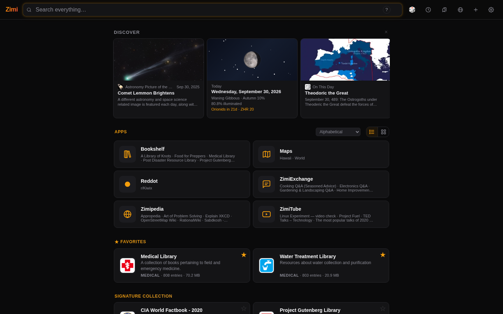
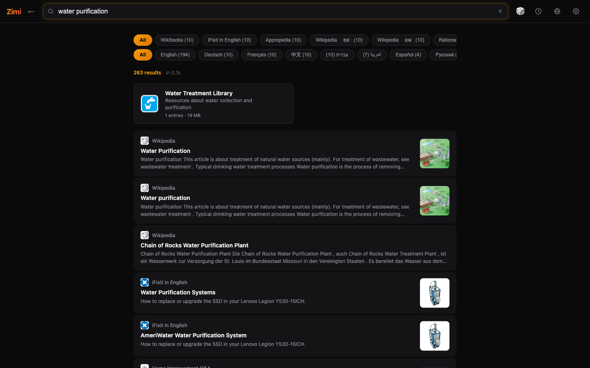
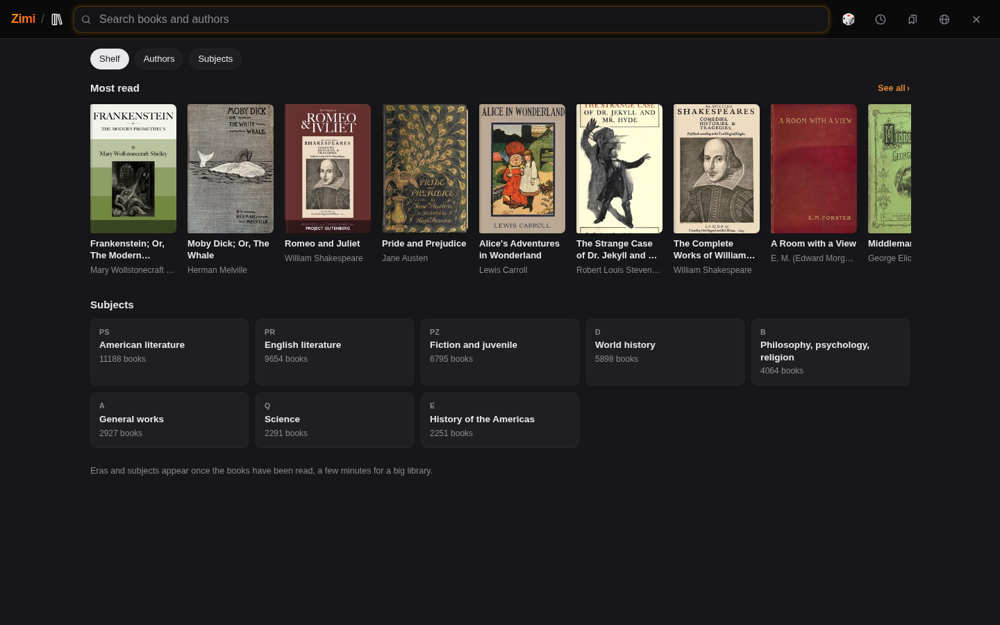
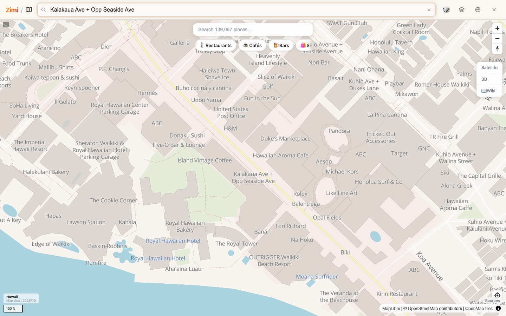
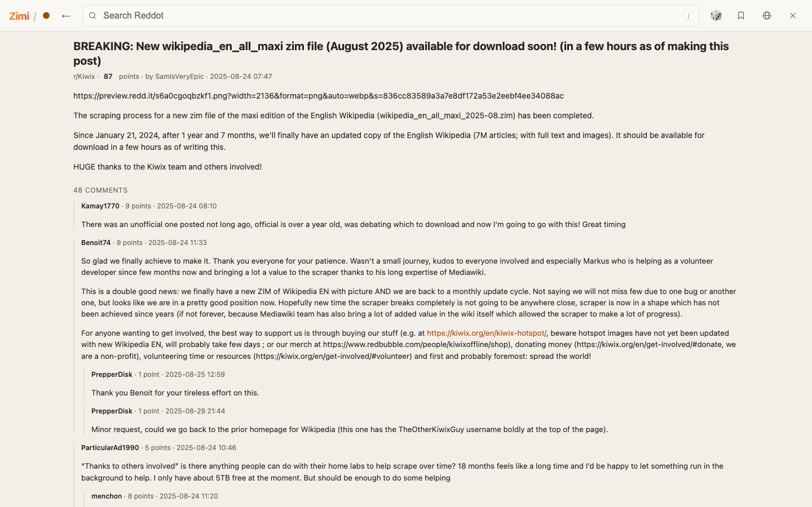
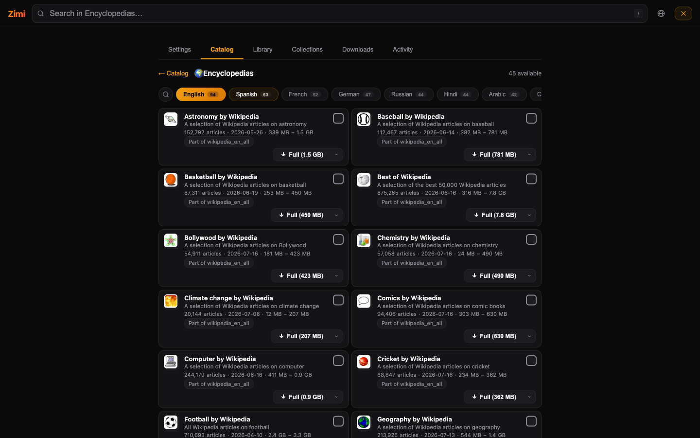
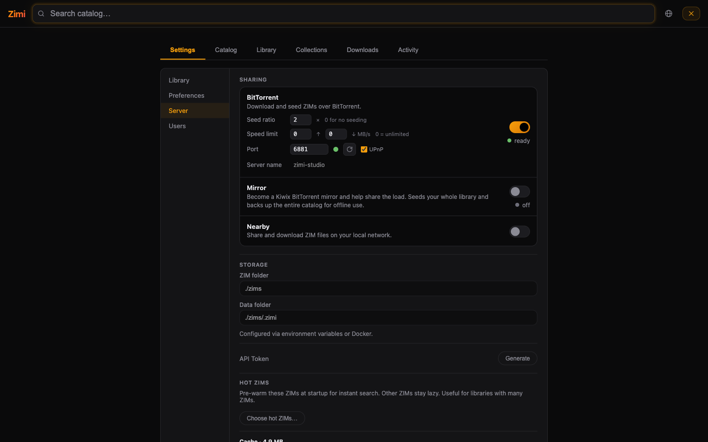
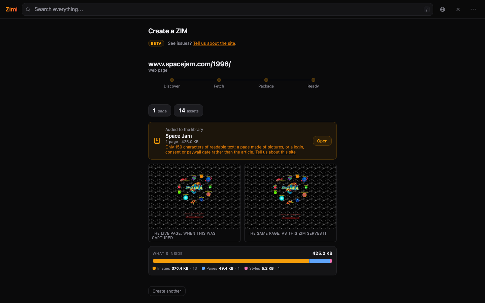

# Zimi

[](https://github.com/epheterson/Zimi/actions/workflows/ci.yml)
[](#)
[](docs/plans/2026-04-26-accessibility.md)
[](docs/plans/2026-04-26-accessibility.md)
[](#languages)
[](https://hub.docker.com/r/epheterson/zimi)
[](https://pypi.org/project/zimi/)
[](LICENSE)

Everything in your ZIM files, as small or as big as you need.

[Kiwix](https://kiwix.org) packages the world's knowledge into ZIM files: Wikipedia, Stack Overflow, Project Gutenberg, dev docs, TED talks and thousands more. Zimi runs on top of them in one of three shapes. All of it works offline, in your language.

| | What you get | Start with |
|---|---|---|
| **Search for agents and scripts** | An [MCP server](#mcp-server): one query across every ZIM, pages as Markdown, sized for small local models. 280 KB, no web app. The full install adds `zimi search` and `zimi read` for the shell. | `pip install zimi-mcp` |
| **A ZIM reader and library** | A fast reader for every ZIM, search across all of them, and the whole Kiwix catalog with downloads and auto-updates. Nothing else on the page. | `pip install zimi`, then `ZIMI_APPS=0 zimi serve` |
| **The whole app** | Discover, apps over your library, a dictionary that speaks, your own ZIMs, sharing on your network. | [Install](#install) |

Same code, same releases: each shape is the one before it with more switched on. Apps turn on and off later in Settings, no restart.

## The whole app

- **Search everything.** One query across every ZIM, 100M+ articles, with `-word`, `"exact words"`, `OR`, `lang:` and `in:` when you need them.
- **Discover.** A fresh front page every day from your own library: the picture, the word and the quote of the day, on this day, and more.
- **Apps over your library.** Zimipedia for every wiki, Bookshelf for every book, ZimiTube for video, ZimiExchange for Q&A, Reddot for subreddits, and offline street Maps.
- **Read and listen.** A Dictionary across every Wiktionary, Say in offline voices, PDFs and textbooks in Zimi's own readers.
- **Keep what you find.** Bookmarks, lists, likes and highlights in every app, synced across devices when you sign in.
- **A real library.** The whole Kiwix catalog one click away, even offline, with auto-updates and BitTorrent downloads that seed back.
- **Make your own ZIMs.** A web page, a whole site, a video playlist, a subreddit, a web archive or a folder of your files.
- **Share on your network.** Zimi devices find each other and pass ZIMs at LAN speed.
- **Every language.** Articles across languages by Wikidata ID; ten UI languages, right-to-left included.
- **Runs anywhere.** Docker, Podman, pip, macOS, Windows, Linux, or your phone as a PWA.

## Screenshots

| Homepage | Search Results |
|----------|---------------|
|  |  |

| Zimipedia | Bookshelf |
|-----------|-----------|
|  |  |

| Maps | ZimiTube |
|------|----------|
|  |  |

| Reddot | Catalog |
|--------|---------|
|  |  |

| Sharing | Make a ZIM |
|---------|------------|
|  |  |

## Install

**macOS**

```bash
brew tap epheterson/zimi
brew trust --tap epheterson/zimi   # Homebrew 6 and later
brew install --cask zimi
```

**Linux:** `sudo snap install zimi`, or the [AppImage](https://github.com/epheterson/Zimi/releases) (it updates itself; the window needs WebKitGTK 4.1 from your distro, otherwise Zimi opens in your browser).

**Windows:** the installer or portable zip from [Releases](https://github.com/epheterson/Zimi/releases).

**Docker**

```bash
docker run --network host -v ./zims:/zims -v ./zimi-config:/config epheterson/zimi
```

`/zims` holds your ZIM files, `/config` keeps settings and indexes. Open http://localhost:8899. Host networking lets LAN discovery and seeding work; for bridge mode, Compose, rootless Podman and Kubernetes see [operations](docs/features/operations.md) and [networking](docs/deployment-networking.md).

**Python**

```bash
pip install zimi
ZIM_DIR=./zims zimi serve --port 8899
```

Two packages: `pip install zimi` is the complete experience; `pip install zimi-mcp` is only the [MCP server](#mcp-server) and search, for AI agents (280 KB, no web app).

Most people configure nothing. Everything is in Settings; `zimi config` prints every effective value and where it came from, and each `ZIMI_*` variable is documented in the guides below.

## Documentation

- [Reading](docs/features/reading.md): search, the reader, Reader View, find in page, languages, PDFs, offline use.
- [Apps](docs/features/apps.md): Zimipedia, Bookshelf, ZimiTube, ZimiExchange, Reddot and Maps.
- [Saving](docs/features/saving.md): bookmarks, lists, likes, highlights, sync.
- [Making ZIMs](docs/features/making-zims.md): every capture mode, folders and their metadata files, web archives.
- [Getting & sharing](docs/features/getting-and-sharing.md): the catalog, downloads, auto-update, BitTorrent, Nearby.
- [Access](docs/features/access.md): public access, accounts, per-ZIM allowlists, single sign-on.
- [Operations](docs/features/operations.md): configuration, backup, air-gapped use, monitoring, updates.
- [API & MCP](docs/features/api-and-mcp.md): the JSON API (`/openapi.json`), RAG chunks, the MCP server and its tools.

## MCP server

```bash
pip install zimi-mcp
zimi-mcp /path/to/zims
```

```json
{
  "mcpServers": {
    "zimi": { "command": "zimi-mcp", "args": ["/path/to/zims"] }
  }
}
```

`zimi-mcp` is the MCP server and search alone, built from this repository and released with it. `pip install "zimi[mcp]"` gives the full install the same command, and `zimi mcp`. Three tools by default (search, read a page as Markdown, read one section), about 360 tokens of schema, sized for small local models; `--tools full` serves every tool. No web server is started. For Docker on another machine, run `docker exec -i zimi python3 -m zimi mcp` over ssh. See [API & MCP](docs/features/api-and-mcp.md#just-the-basics) for the tools and measured numbers, and the [SearXNG](docs/integrations/searxng.md) and [OpenWebUI](docs/integrations/openwebui.md) guides.

## Contributing

Issues and ideas are welcome, and every one gets answered. See [CONTRIBUTING.md](CONTRIBUTING.md); security reports go privately per [SECURITY.md](SECURITY.md).

## License

[MIT](LICENSE). Desktop and Docker builds bundle [libtorrent-rasterbar](https://libtorrent.org/) (BSD-3-Clause), see [THIRD_PARTY_NOTICES.md](THIRD_PARTY_NOTICES.md).

---

Built with ❤️ in California by [@epheterson](https://github.com/epheterson) and [Claude Code](https://claude.ai/code).
